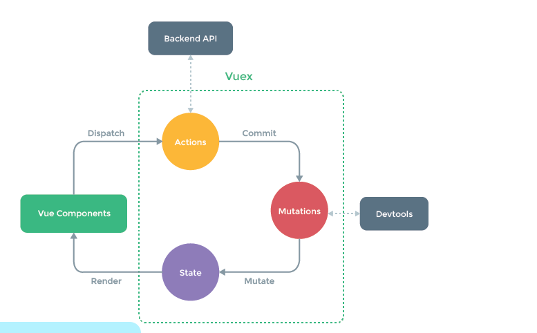

##面试题

### CSS类
> 1.假设高度已知，请写出三栏布局，其中左栏、右栏宽度各为300px，中间自适应。
    请写出五到七种方案，并说出各种方案的优缺点和兼容性
    
 - 1.浮动
 ```
 <!DOCTYPE html>
 <html lang="en">
 <head>
     <meta charset="UTF-8">
     <title>Title</title>
     <style>
         *{
             margin: 0;
             padding: 0;
         }
 
         .container>div{
             height: 100px;
         }
 
         .container .one{
             background-color: red;
             width: 300px;
             float: left;
         }
 
         .container .two{
             background-color: blue;
             width: 300px;
             float: right;
         }
 
         .container .three{
             background-color: yellow;
         }
     </style>
 </head>
 <body>
 <div class="container">
     <div class="one"></div>
     <div class="two"></div>
     <div class="three"></div>
 </div>
 
 </body>
 </html>
 ```
 - 2.定位
 ```
 <!DOCTYPE html>
 <html lang="en">
 <head>
     <meta charset="UTF-8">
     <title>Title</title>
     <style>
         *{
             margin: 0;
             padding: 0;
         }
 
         .container>div{
             height: 100px;
             position: relative;
         }
 
         .container .one{
             position: absolute;
             left:0;
             top: 0;
             background-color: red;
             width: 300px;
 
         }
 
         .container .two{
             position: absolute;
             right:0;
             top: 0;
             background-color: blue;
             width: 300px;
 
 
         }
 
         .container .three{
             position: absolute;
             left:300px;
             right:300px;
             top: 0;
             background-color: yellow;
         }
     </style>
 </head>
 <body>
 <div class="container">
     <div class="one"></div>
     <div class="two"></div>
     <div class="three"></div>
 </div>
 
 </body>
 </html>

```
- 3.flex布局
```
<!DOCTYPE html>
<html lang="en">
<head>
    <meta charset="UTF-8">
    <title>Title</title>
    <style>
        *{
            margin: 0;
            padding: 0;
        }
        .container{
            display: flex;

        }
        .container>div{
            height: 100px;
        }

        .container .one{
            background-color: red;
            width: 300px;
        }

        .container .two{
            background-color: blue;
            flex: 1;
        }

        .container .three{
            width: 300px;
            background-color: yellow;
        }
    </style>
</head>
<body>
<div class="container">
    <div class="one"></div>
    <div class="two"></div>
    <div class="three"></div>
</div>

</body>
</html>

```
- 4.

> 2.左侧菜单栏占300px，右侧内容可以根据浏览器自适应。根据此要求，编写html css代码
```
  <style>
        .oDiv{
            line-height: 300px;
            text-align: center;
        }

        .left {
            float: left;
            height: 300px;
            width: 300px;
            background-color: lightsalmon;
        }
        .right {
            overflow: auto;
            height: 300px;
            background-color: lightpink;
        }
    </style>
</head>
<body>
<div class="oDiv">
    <div class="left">固定</div>
    <div class="right">自适应</div>
</div>
```
> 3.CSS选择器又哪些？有哪些新特性？有哪些伪类？
```
    css选择器有元素选择器，id选择器，类选择器，属性选择器，派生选择器（有关系的，后代，子代，兄弟）
    新特性：- CSS3
        新增各种CSS选择器     `: not(.input)：所有 class 不是“input”的节点 `
         圆角   `border-radius:8px`
        多列布局  `multi-column layout`
         阴影和反射 `Shadow\Reflect`
        文字特效   `text-shadow`
        文字渲染   `Text-decoration `
        线性渐变   `gradient `
        旋转    `transform`
        增加了旋转,缩放,定位,倾斜,动画，多背景
        `transform:\scale(0.85,0.90)\ translate(0px,-30px)\ skew(-9deg,0deg)\Animation`

    伪类：- css有哪些伪类
       - :root 选择元素所在文档的根元素
       - :not（）否定选择器
       - :empty 用来选择没有任何内容的元素
       - F : first-child 选择F的第一个子元素(所有第一个子元素都会被选择) 
       - :last-child 选择最后一个子元素
       - :nth-child(n) 用来定位某父元素的一个或多个特定的子元素
       - :nth-last-child(n) 选择在其父元素中倒数第n个位置的元素或特定某元素
       - :first-of-type 父元素下的某个类型的第一个子元素
       - :last-of-type 选择是父元素下的某个类型的最后一个子元素
       - :nth-of-type(n)只计算父元素中指定的某种类型的子元素
       - :only-child 有且仅有一个子元素 
       
       其他的常见伪类选择器
       - :link表示未访问的超链接
       - visite表示已访问的
       - :hover 鼠标移动到容器
       - :active 被激活时的状态
       - :focus 用于设置获取焦点时的样式
       - :read-only用来指定处于只读状态元素的样式
       - :read-write 用来指定当元素处于非只读状态时的样式

```
> 4.清除浮动的几种方式，优缺点
```
    1.给浮动元素的父元素加高度  
        原理:父级手动定义height，就解决了父级无法自动获取高度的问题
        优点：简单，代码少，易掌握
        缺点：只适合高度固定的布局，要给出精确的高度，如果高度和父级不一样时，会产生问题
    2. 给浮动元素的父级加overflow:hiddren 
        优点：简单，代码少，浏览器支持好
        缺点：不能和position配合使用，超出浏览器的会被隐藏
    3.在浮动元素的父元素结束添加一个空div标签，并添加样式clear:both,让父级div自动获取高度
        优点：简单，代码少，浏览器支持好
        缺点：如果页面浮动布局多，就要增加多个div
    4.給浮动元素的父元素加一个class名 clearfix; 把清浮动的样式放到reset.css/reset.min.css 样式表中 

```
> 5.图片如何实现垂直剧中的
```
 <style>
        *{
            padding: 0;
            margin: 0;
        }
        .oDiv{
            width: 100%;
            height: 100%;
            
        }
        .oDiv img{
            width: 200px;
            height: 200px;
            position: absolute;
            top: 0;
            bottom: 0;
            left: 0;
            right: 0;
            margin: auto;


        }


    </style>
</head>
<body>
<div class="oDiv">
    
</div>

```

> 6.css hack你知道哪些？
```
为了获得统一的页面效果，需要针对不同的浏览器或不同版本写特定的CSS样式，我们把这个针对不同的浏览器/不同版本写相应的CSS code的过程，叫做CSS hack
Css Hack 特殊符号
（1）* ：IE6/7都能识别*，标准浏览器不识别
（2）_：只有IE6识别
（3）！Important：IE6不识别，Firefox，IE7/8/9、chorme等主流浏览器均识别
（4）\9：所有浏览器均识别，包括IE6/7/8
（5）+：IE6/7/8识别
（6）书写顺序：先写FF等非IE浏览器所需样式，其次IE8，再次IE7，最后写IE6

```
> 7.谈谈你对CSS盒模型的认识
    标准模型和IE模型的区别?
    CSS是如何设置这两种模型?
    JS如何设置和获取盒模型对应的宽和高?
    什么是优雅降级和渐进增强?
    
```
标准模型和IE模型的区别:标准模型的宽高就是内容的宽高，IE模型的宽高包含内容+padding+border的宽高
css设置：标准  box-sizing:content-box,IE  box-sizing:border-box
js设置 ：ele.style.width=50px  获取：window.getComputedStyle.width
渐进增强  针对低版本浏览器进行构建页面，保证最基本的功能，然后再针对高级浏览器进行效果、交互等改进和追加功能达到更好的用户体验。
        .transition{
       -webkit-transition: all .5s;
          -moz-transition: all .5s;
            -o-transition: all .5s;
               transition: all .5s;  
     }
优雅降级  一开始就构建完整的功能，然后再针对低版本浏览器进行兼容。
        .transition{ 
        　　     transition: all .5s;
        　　  -o-transition: all .5s;
          　-moz-transition: all .5s;
         -webkit-transition: all .5s;
        }


```

> 8.谈谈你对BFC的了解
    什么是BFC?
    如何创建BFC?
    BFC使用场景?
```
BFC（Block Formatting Context）  块级格式化范围
创建BFC：生成了一个块级的元素，同时元素也就生成了一个块级盒
通俗讲，BFC就是一种布局方式，在创建了 BFC后，其子元素会一个接一个地放置：盒子们自所在的 containing block 顶部起，水平方向上一个接一个撑满整个宽度，垂直方向上他们的起点是包含块的顶部，两个相邻的元素之间的垂直距离取决于 ‘margin’ 特性。在 同一个BFC中，两个元素才有可能发生垂直Margin的重叠，这个包括相邻元素，嵌套元素，只要他们之间没有间隔(即父元素的边框，非空内容，padding等)就会发生margin重叠，即margin会发生重合。更重要的是：创建BFC,能消除元素对相邻元素的布局影响，常见的应用 是：使用overflow:hidden创建BFC ,来清除浮动元素对后面元素的布局影响 。
 BFC使用场景?
>BFC的主要作用有以下几点：
- 边距重叠
- 不与float box重叠
- 高度塌陷

```

###JS类

> 1. DOM事件
    DOM事件级别有哪些?
    描述DOM事件捕获和冒泡的具体流程?
    Event对象的常见应用场景?
    事件委托是什么？
    事件冒泡,e.target和e.currentTarget的区别
    浏览器的兼容问题(js)
    
```
DOM事件有DOM0级，DOM2级事件
DOM0级事件只有冒泡阶段，没有捕获，DOM2级两者都有
冒泡是由里向外触发，捕获是由外向里触发
应用场景：事件委托时，可以利用e.target的不同来委托不同的事件。
e.preventDefault  阻止默认行为，e.stopPropergation阻止冒泡
e.clientX,e.clientY  等 可以用来计算元素的位置
事件委托：当一个容器内部中多个元素需要绑定同一个事件的时候，可以利用事件默认冒泡的机制，将事件绑定给最外层容器，这样最外层容器的相关行为触发的时候会影响内部的相关行为触发
事件冒泡：当子元素的相关行为触发的时候，会导致父级元素的相关行为触发
e.curretnTarge是指注册了事件监听器的对象，e.target是指对象里的子对象，实际触发这个事件的对象。

兼容问题
let one=document.querySelector('.one');
    one.onclick=function (e) {
        e=e||window.event;
        e. target = e.target || e.srcElement;
        e.stopPropagation? e.stopPropagation() : e.cancelBubble = true;
        e.preventDefault? e.preventDefault() : e.returnValue = false;
        let sLeft = document.documentElement.scrollLeft || document.body.scrollLeft;
        let sTop = document.documentElement.scrollTop || document.body.scrollTop;
        e.pageX = e.pageX || (e.clientX + sLeft);
        e.pageY = e.pageY || (e.clientY + sTop);
    }


```

> 2. JS原生
    JS中有哪些数据类型
    什么是闭包？闭包作用？在工作中是如何应用的?
    JS实现继承的几种方式?
    创建对象的三种方式?
    new Person()时发生了什么?
    什么是深拷贝和浅拷贝？自己不用JSON.parse实现一个深拷贝的方法
    手工模拟完整的bind方法
    什么是节流和防抖？
    上拉刷新和下拉加载的实现原理？
    写一个验证邮件的正则表达式
    事件绑定和普通事件的区别（可以举例说明）
    javascript 模版引擎用过哪些？实现原理是什么？
    合并两个对象
    动态向一个div中插入1000个div标签，如何实现？（考性能）
    html5新特性
    严格模式和非严格模式的区别
    对于js中浮点数计算会丢失精度的问题，你有什么解决思路？
    
```
数据类型：基本数据类型（Number,String,Boolean,Null,Undefined）引用数据类型（Object,Array,Date,Function,RegExp）
闭包：函数执行都会形成一个私有作用域 保护里面私有变量不受外界干扰 这种保护机制叫闭包，应用：可以用来封装方法
继承：1.原型链继承（将子类的原型作为父类的一个实例，这样是将父类公有的和私有的属性都继承给子类的公有属性上）
    2.借用构造函数继承（call方法）（将父类当成一个普通函数在子类中执行，并且更改父类中的this，这样执行父类就相当于在给子类增加私有属性，只能继承父类私有的）
    3.原型式继承（利用Object.create()方法，重新构建父类的原型为一个新的对象，并且让子类的原型指向重建后的对象，这样继承的是父类公有的方法，但是有兼容性）
    4.冒充对象继承（在子类中创建父类的实例，然后把他当做普通对象遍历，遍历出来的私有的公有的属性都用this复制一份）
    5.中间类继承   （通过__proto__修改原型指向）
    6.es6提供的继承方法   子类 extends 父类{constructor(){super()}}
    
创建对象:  1.let obj={}   2.let obj=new Object() 3.let obj=new Fn()(构造函数创建)
new Person()：创建了一个Person的实例，并让这个实例执行
深拷贝：指的是对象中，里边存放的对象和以前的对象毫无关系，但是长得一样
浅拷贝：浅拷贝里存放的内容和以前是同一个地址
实现深拷贝： 1.{...obj} 2. 循环递归也可以实现深拷贝
myBind:  function myBind(context, fn) {
               return function (e) {
                   fn.call(context, e)
               }
           }
           
函数防抖(debounce)就是让某个函数在上一次执行后，满足等待某个时间内不再触发此函数后再执行，而在这个等待时间内再次触发此函数，等待时间会重新计算。
函数节流(throttle)就是每间隔某个时间去执行某函数，避免函数的过多执行，这个方式就叫函数节流。

上拉刷新，下拉加载：无论是下拉刷新还是上拉加载更多，原理都是在内容View不能下拉或者上划时响应用户的触摸事件，在顶部或者底部显示一个刷新视图，在程序刷新操作完成后再隐藏掉。

验证邮件：let reg = /^\w+@[0-9a-z]{2,8}(\.[a-z]{2,8}){1,2}$/;
事件绑定和普通事件的区别:1.普通事件不能重复，addEventListener 可以绑定多个处理函数 2.普通事件只有冒泡阶段，事件绑定可以也可以有捕获阶段

模板引擎：javaScript的Embedded JS Teamplates（EJS）的模板引擎
通过分析模板，将数据和模板结合在一起输出最后的结果的程序称为模板引擎

合并两个对象:1.{...oldObj,newObj} 2.Object.assign(tar,oldObj,newObj)

动态插入div:  <div id="container">
              1
          </div>
          <script>
              let container=document.getElementById('container');
              let frag=document.createDocumentFragment();
              container.onclick=function () {
                  for(let i=0;i<1000;i++){
                      let div=document.createElement('div');
                      div.innerHTML= 2;
                      frag.appendChild(div)
                  }
                  container.appendChild(frag);
              }
 </script>
 
 h5新特性：1.语义化标签  2.媒介 音视频 audio video 3.canvas 绘画 4.地理定位 Geolocation 5.本地存储 localStorage 二级缓存  （Cookies） 6.WebSocket 通讯协议 7.表单控件
 
 严格模式和非严格模式的区别:
    'use strict' 表示在严格模式下运行
      严格模式下, delete运算符后跟随非法标识符(即delete 不存在的标识符)，会抛出语法错误； 非严格模式下，会静默失败并返回false
      严格模式中，对象直接量中定义同名属性会抛出语法错误； 非严格模式不会报错
      严格模式中，函数形参存在同名的，抛出错误； 非严格模式不会
      严格模式不允许八进制整数直接量（如：023）
      严格模式中，arguments对象是传入函数内实参列表的静态副本；非严格模式下，arguments对象里的元素和对应的实参是指向同一个值的引用
      严格模式中 eval和arguments当做关键字，它们不能被赋值和用作变量声明
      严格模式会限制对调用栈的检测能力，访问arguments.callee.caller会抛出异常
      严格模式 变量必须先声明，直接给变量赋值，不会隐式创建全局变量，不能用with,
      严格模式中 call apply传入null undefined保持原样不被转换为window
 
精确浮点数：使用toFixed()的方法，但是这个也不太准确
           

 
```
> 3.JQuery
    jquery.extend , jquery.fn.extend的区别
    谈一下jquery中的bind，live，delegate，on区别
    document.ready和document.load和$(function(){})有什么区别？
    $.data()和$('#aaa').data()各自作用是什么？有什么区别
    
```
jquery.extend:把两个或者更多的对象合并到第一个当中,但是只跟这个 类 本身有关，跟实例无关。一般由传入的全局函数来调用，主要是用来拓展个全局函数，如$.init()，$.ajax();
jquery.fn.extend:把对象挂载到jQuery的prototype属性，来扩展一个新的jQuery实例方法，一般由具体的实例对象来调用，可以用来拓展个选择器，例如$.fn.each(); 大部分插件都是用jQuery.fn.extend()
bind 只能绑定事件，需要通过delegate 和live（已经被废除）来进行事件委托，on是事件委托与事件绑定同时完成
document.ready 和$(function(){})是页面DOM结构加载完触发，$(function(){})是缩写，document.ready 可以绑定多次
document.load是页面中所有资源，包括DOM结构，图片，音频什么的都加载完触发，只能绑定一次执行一次

$.data()可以存储，也可以获取，$('#aaa').data()是获取


```
> 4.ES6
    什么时候应该用箭头函数？什么时候不能用？ － 请写出ES6中Array.isArray()的实现代码
    如何在项目中解析处理es6和es7代码
    Promise常用方法，Promise.race的作用，then方法里reject和catch的区别
    
```
一般时候都可以用箭头函数，当需要保留上级this的时候可以使用箭头函数，但是，当需要arguments的时候不能使用箭头函数

babel-preset-es2015   解析es6  babel-preset-stage-0解析es7  
然后在.babelrc 中配置 "presets": ["es2015","stage-0"]

Promise.race将多个Promise实例，包装成一个新的Promise实例。谁最快结果就以谁为主，返回的结果只是数组中的某一个
若只调用了一次then方法，reject和catch是一样的效果，若调用了多次的then方法，reject是一个then方法中的错误，catch是所有的then方法中的错误都会走到catch

```
    
> 5.工程化
    什么叫模块化？你用过哪些模块化解决方案？
    什么叫组件化？你在工作中是如何实现组件化的？
    gulp和webpack的相同点和不同点?
    什么是热加载?
    
```
模块化：一个js文件就是一个模块，CommonJS  AMD  CMD  es6模块化开发  node采用的是CommonJS
组件化：一个.vue文件就是一个组件，有页面级组件，局部组件，可以实现复用，减轻了diamante负担，vue,react

Gulp就是为了规范前端开发流程，实现前后端分离、模块化开发、版本控制、文件合并与压缩、mock数据等功能的一个前端自动化构建工具
Webpack 是前端资源模块化管理和打包工具，它可以将许多松散的模块按照依赖和规则打包成符合生产环境部署的前端资源
热加载：编译Java类后不重启Tomcat的一种方式
```
    
> 6.框架
    前端路由的实现原理
    MVVM框架解决了什么问题？带来了什么问题？
    浏览器地址栏里面的'＃' 如何清楚？mode共有几个参数，参数有什么区别？
    vue中父组件如何给子组件传递值
    react的优缺点
    React组件中props和state有什么区别？
    什么是JSX
    说一下angular、vue、react的相同点和不同点?各适用于什么样的项目场景?
    React中不同组件传递数据的方式有哪些？至少说出三种
    请描述React的组件加载生命周期函数以及shouldComponentUpdate方法的实际使用场景?
    
```
原理：通过不同的请求路径返回不同的内容
vue 中父组件通过属性将值传递给子组件，子组件用props接收
react优点：组件化,把一个复杂的页面分成一个一个小组件，实现复用，不用自己维护数据与DOM对象的一致
    缺点：并不是一个完整的框架，基本都需要加上ReactRouter和Flux才能写大型应用
    
React组件中props不能直接修改，可以通过父组件更改状态来修改属性，state直接修改不会渲染页面，只能调用setState()方法来进行修改

JSX：javascript+xml  是一种JS和HTML混合的语法,将组件的结构、数据甚至样式都聚合在一起定义组件,会编译成普通的Javascript。
angular、vue、react：vue、react使用起来更轻便一些


```

> 7.HTTP
    HTTP报文的组成部分
    GET和POST的区别
    HTTP常见状态码
    什么是Restful API?
    HTTPS和HTTP的区别是什么?
    从在浏览器中输入URL到页面渲染出来都经过了什么过程？
    JSON和JSONP 区别是什么？JSONP的原理是？
    用过那些跨域技术
    ajax的参数
    
```
HTTP报文:请求头，请求行，请求体，响应头，响应行，响应体
GET和POST的区别：1.传输方式：get 通过url 问号传参的方式传递，post通过请求体传递信息    2.长度：由于url有长度限制，所以get方式传递的信息也有长度限制，post没有   3.安全：post相对比get安全些  4.get没有请求体，post有
HTTP常见状态码：200:'OK',
            206:'Partial Content',//部分内容 下载
            301:'Moved Permanently',//永久重定向
            302:'Found',//临时重定向
            304:'Not Modified',//缓存发现
            400:'Bad Request', //客户端请求错误
            401:'Unauthorized',//未授权的
            403:'Forbidden',//无权访问
            404:'Not Found',//资源未找到
            500:'Internal Server Error', //服务器内部错误
            503:'Service Unavailable' //服务器暂时不可用
            
HTTPS和HTTP的区别HTTPS要比http更安全

restful  对于资源的具体操作类型，由HTTP动词表示。
GET（SELECT）：从服务器取出资源（一项或多项）。 返回所有或者是查询的那一项
POST（CREATE）：在服务器新建一个资源。  返回增加的项
PUT（UPDATE）：在服务器更新资源（客户端提供改变后的完整资源）。 返回修改的项

DELETE（DELETE）：从服务器删除资源。  返回一个空对象

从在浏览器中输入URL到页面渲染出来都经过了什么过程？
---前端通过url发出请求，然后通过DNS解析后台的IP地址，找到对应的服务器，根据端口找到对应的门，后台根据前台的请求返回响应的数据，前端收到数据后进行解析渲染页面。

JSON是一种基于文本的数据交换方式（不支持跨域），而JSONP是一种非官方跨域数据交互协议。
JSONP原理：js文件的调用不受跨域与否的限制，因此如果想通过纯web端跨域访问数据，只能在远程服务器上设法将json数据封装进js格式的文件中，供客户端调用和进一步处理

ajax的参数             url:null, 路径
                     type:'GET', 请求方式
                     cache:true,  是否缓存
                     context:null, 
                     async:true, 是否异步
                     data:null,  数据信息
                     dataType:'text',  返回的数据类型
                     success:null,   成功后的回调
                     error:null,    错误
                     timeout:null,  超时

```

> 8.前后端通信
    什么是同源策略及限制?
    前后端如何通信?
    用原生JS模拟一下jquery的ajax方法
    跨域通信的几种方式?
    
```
源是由URI，主机名，端口号组合而成的。
同源策略下web浏览器允许第一个页面的脚本访问第二个页面里的数据，但是也只有在两个页面有相同的源时。
这个策略可以阻止一个页面上的恶意脚本通过页面的DOM对象获得访问另一个页面上敏感信息的权限。
前后端通信：前端向指定路径/接口发送请求，后端根据路径/接口返回相应的内容，响应给前端，前端解析然后渲染页面
原生ajax：(function () {
    //生成实例
    function getXhr() {
        let arr=[function () {
            return new XMLHttpRequest();
        },function () {
           return new ActiveXObject('Microsoft.XMLHTTP') ;
        },function () {
            return new ActiveXObject('Msxml2.XMLHTTP') ;
        },function () {
            return new ActiveXObject('Msxml3.XMLHTTP') ;
        }];
        let xhr=null;
        for (var i = 0; i < arr.length; i++) {
            try{
                getXhr=arr[i];
                xhr=arr[i]();
                break;
            }catch(e){}

        }
        if(!xhr){
            throw new Error('请跟新浏览器')
        }
        return xhr;
    };
    function ajax(options) {
        let _options={
            url:null,
            type:'GET',
            cache:true,
            context:null,
            async:true,
            data:null,
            dataType:'text',
            success:null,
            error:null,
            timeout:null,
        };
        //合并参数
        Object.assign(_options,options);
        //处理参数
        if(!_options.url){
           console.warn('请提供有效的url');
           return;
        }
        if(_options.url.indexOf('?')>-1){
            _options.url=_options.url.slice(0,-1)
        }
        let flag=false;
        if(_options.type.toUpperCase()==='GET'){
            if(!_options.cache){
                _options.url+='?_='+Date.now();
                flag=true;
            }
            for(let k in _options.data){
                if(_options.data.hasOwnProperty(k)){
                    if(flag){
                        _options.url+='&'+k+'='+_options.data[k];
                    }else{
                        _options.url+='?'+k+'='+_options.data[k];
                        flag=true;
                    }
                }
            }
        }
        //创建ajax实例
        let xhr=getXhr();
        let {url,type,async,data,dataType,timeout,error,success,context}=_options;
        context||(context=_options)
        xhr.open(type,url,async);
        xhr.responseType=dataType;
        xhr.timeout=timeout;
        xhr.onerror=xhr.ontimeout=error;
        xhr.onreadystatechange=function(){
            if(this.readyState===4&&/^2\d{2}$/.test(this.status)){
             typeof success==='function'?success.call(context,this.response):null;
            }
        };
        xhr.send(JSON.stringify(data))


    }
    window.$$={ajax};


})();

跨域通信的几种方式： jsonp  CORS  postMessage()  beacon (ping) submit协议

```
    
> 9.安全
    CSRF的原理以及如何防御
    XSS的原生和如何防御
    
```
CSRF的原理 1.客户端浏览并登陆信任的网站A 2.验证通过，此时A向客户端种植cookie 3.客户端在没有退出A网站时访问了危险网站B 4.B要求客户端访问A 5.此时客户端再访问A并将之前A种植的cookie返回给A  6.A不知道4的请求时谁发出的，浏览器会根据cookie默认处理，这样危险B就模拟了客户端向A发出请求
CSRF 防御  1.通过 referer、token 或者 验证码 来检测用户提交。
         2.尽量不要在页面的链接中暴露用户隐私信息。
         3.对于用户修改删除等操作最好都使用post 操作 。
         4.避免全站通用的cookie，严格设置cookie的域。
         
Xss(cross-site scripting)攻击指的是攻击者往Web页面里插入恶意html标签或者javascript代码。
防御：
1.代码里对用户输入的地方和变量都需要仔细检查长度和对”<”,”>”,”;”,”’”等字符做过滤；其次任何内容写到页面之前都必须加以encode，避免不小心把html tag 弄出来。这一个层面做好，至少可以堵住超过一半的XSS 攻击。
2.避免直接在cookie 中泄露用户隐私，例如email、密码等等。
3.通过使cookie 和系统ip 绑定来降低cookie 泄露后的危险。这样攻击者得到的cookie 没有实际价值，不可能拿来重放。
4.尽量采用POST 而非GET 提交表单

```
    
> 10.渲染机制
    什么是DOCTYPE及作用?标准模式和兼容模式有什么区别?
    浏览器是如何渲染页面的?
    什么是重排？什么时候会触发重排?
    什么是重绘？什么时候会触发重绘?
    
```
作用：告知浏览器的解析器用什么文档标准解析这个文档。DOCTYPE不存在或格式不正确会导致文档以兼容模式呈现。
区别：1.width不同
   在严格模式中 ：width是内容宽度 ，元素真正的宽度 = margin-left + border-left-width + padding-left + width + padding-right + border-right- width +  margin-right;
   在兼容模式中 ：width则是元素的实际宽度 ，内容宽度 = width - ( padding-left + padding-right + border-left-width + border-right-width)
   2.兼容模式下可设置百分比的高度和行内元素的高宽
       在Standards模式下，给span等行内元素设置wdith和height都不会生效，而在兼容模式下，则会生效。
       在standards模式下，一个元素的高度是由其包含的内容来决定的，如果父元素没有设置高度，子元素设置一个百分比的高度是无效的。
   
   3.用margin:0 auto设置水平居中在IE下会失效
       使用margin:0 auto在standards模式下可以使元素水平居中，但在兼容模式下却会失效（用text-align属性解决）
       body{text-align:center};#content{text-align:left}
   
   4.兼容模式下Table中的字体属性不能继承上层的设置，white-space:pre会失效，设置图片的padding会失效
   
浏览器是将代码从上到下进行解析渲染的

重绘不一定伴随重排，重排也不一定会引起浏览器的重绘
重绘：只是改变某个元素的背景色、文 字颜色、边框颜色等等不影响它周围或内部布局的属性，会导致重绘
重排：当DOM的变化影响了元素的几何属性（宽或高），浏览器需要重新计算元素的几何属性，页面会重新渲染，这个过程叫重排

```
    
> 11.JS运行机制
    如何理解JS的单线程
    什么是Event Loop,请简述其过程
    
```
JS运行在浏览器中，是单线程的，在某个特定的时刻只有特定的代码能够被执行，并阻塞其它的代码。但浏览器是事件驱动的，浏览器中很多行为是异步的，会创建事件并放入执行队列中。

Event Loop  解决单线程问题，在JS主线程的执行中，主线程只会做一件事情，就是从消息队列里面取消息、执行消息，再取消息、再执行。当消息队列为空时，就会等待直到消息队列变成非空。而且主线程只有在将当前的消息执行完成后，才会去取下一个消息。这种机制就叫做事件循环机制，取一个消息并执行的过程叫做一次循环。

```
> 12.服务器
    如何在web应用中在实现权限控制?
    Web服务器、应用服务器、Web容器、反向代理服务器的区别和联系?
    
```
Web服务器的基本功能就是提供Web信息浏览服务。主要支持的协议就是HTTP
应用程序服务器让多个用户可以同时使用应用程序（通常是客户创建的应用程序）
Web服务器传送(serves)页面使浏览器可以浏览，然而应用程序服务器提供的是客户端应用程序可以调用(call)的方法(methods)
servlet可以理解服务器端处理数据的java小程序,管理servlet就是web容器
反向代理（Reverse Proxy）方式是指以代理服务器来接受internet上的连接请求，然后将请求转发给内部网络上的服务器，并将从服务器上得到的结果返回给internet上请求连接的客户端，此时代理服务器对外就表现为一个反向代理服务器。


```
>13.错误处理
    前端错误的分类?
    程序出现bug了，你是如何调试的?
    如何分类捕获不同的错误?
    如何把生产环境的错误上报？
    
```
错误：1.将input设为只读，使用readonly而非diabled
     2.滥用元素  过多的ul,li
     3.应该避免每个元素上不止一个class
     4.定义 img元素 的 alt 属性(图片无法显示的时候，显示相应的文本)
     5.label元素的 for 属性；
     6.注意checkbox默认打勾属性（<input type="checkbox" checked="checked">）
     7.为parseInt设置第二个参数
     8.进行浮点数计算之后，调用toFiexd。
调试bug:看报错的地方，报错原因，根据报错原因来解决问题
捕获错误: try{}catch(e){}可以捕获报错，其中的e可以捕获报错信息

```
> 14.页面性能
    前端性能优化的方法有哪些？至少说出10种以上
    如何实现JS的异步加载? async和defer的区别是什么?
    
```
前端性能优化的方法:1.减少http请求 2.延迟加载 3.提前加载 4.使用外部js,css  5.避免多次操作DOM 6.使用雪碧图  7.避免页面跳转 8.缓存数据 9.避免404  10.减少cookie大小

在页面中<script>标签内，用 js 创建一个 script 元素并插入到 document 中。这样就做到了非阻塞的下载 js 代码。并添加async=true属性

<script src="script.js"></script>
没有 defer 或 async，浏览器会立即加载并执行指定的脚本，“立即”指的是在渲染该 script 标签之下的文档元素之前，也就是说不等待后续载入的文档元素，读到就加载并执行。
<script async src="script.js"></script>
有 async，加载和渲染后续文档元素的过程将和 script.js 的加载与执行并行进行（异步）。
<script defer src="myscript.js"></script>
有 defer，加载后续文档元素的过程将和 script.js 的加载并行进行（异步），但是 script.js 的执行要在所有元素解析完成之后，DOMContentLoaded 事件触发之前完成。


```
> 15.缓存
    Expires和Cache-Control是如何工作的？
    Last-Modified和Etag是如何工作的？
    请描述cookie、sessionStorage和localStorage的区别
> 16.项目问题
    介绍一下你的项目？这个项目有哪些模块？你负责哪些模块？
    你在项目中的角色
    你觉得在项目中做的最出彩的点有哪些？
    遇到过哪些非常难以解决的问题？最终是如何解决的？
    如果你是项目负责人，你会如何分配任务？如何保证按时完成？如何让成员够持续成长？
> 17.